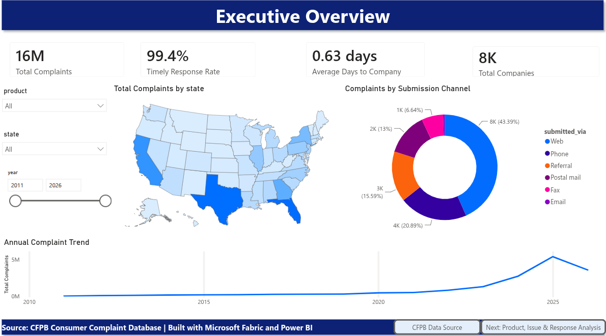
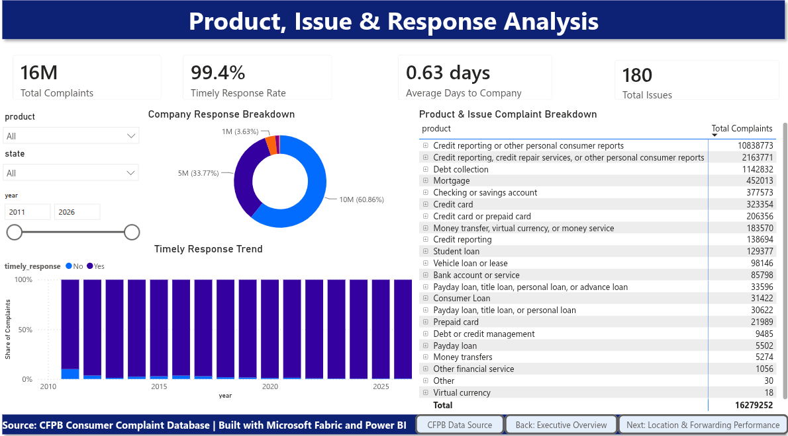
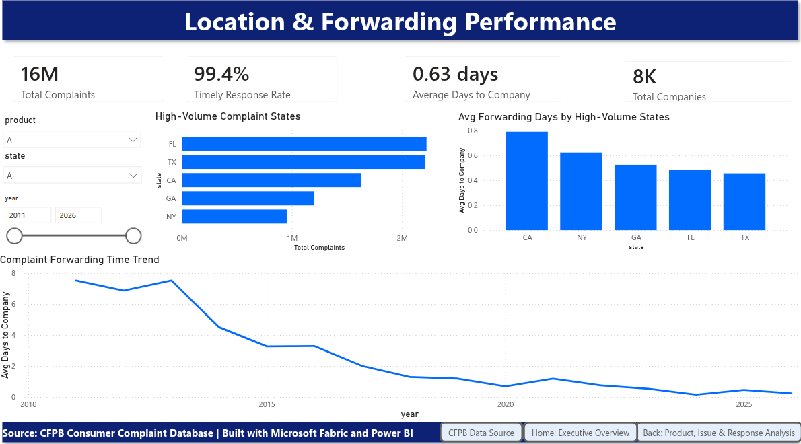
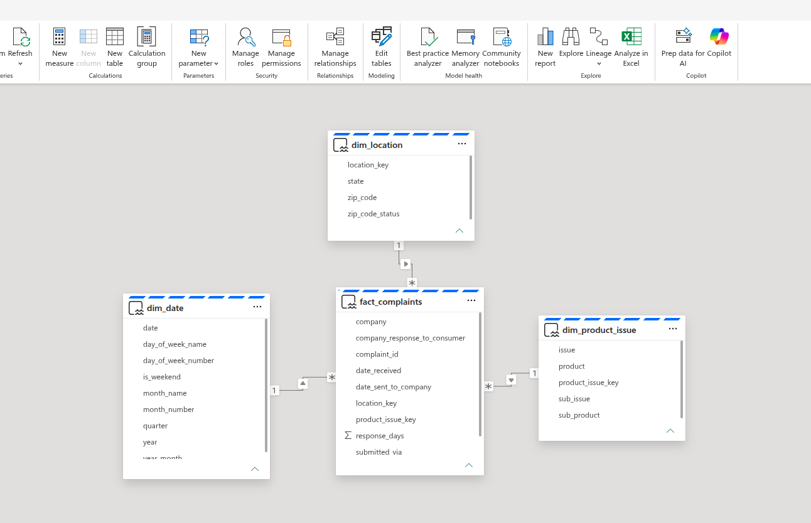

# CFPB Consumer Complaints Analytics

This project analyzes consumer financial complaints from the CFPB Consumer Complaint Database using Microsoft Fabric and Power BI.

I built an end-to-end analytics workflow that takes a large raw complaints dataset, processes it through Bronze, Silver, and Gold layers, and turns it into a Power BI dashboard for exploring complaint trends, product and issue drivers, geographic patterns, and company response performance.

## Dashboard Preview

### Executive Overview



### Product, Issue & Response Analysis



### Location & Forwarding Performance



## What This Dashboard Helps Answer

- Which financial products receive the most complaints?
- Which complaint issues appear most often?
- How has complaint volume changed over time?
- Which states have the highest complaint volume?
- How are complaints submitted?
- How quickly are complaints forwarded to companies?
- What percentage of complaints receive timely responses?

## Tech Stack

Built with **Microsoft Fabric, PySpark, Spark SQL, Delta tables, Power BI, semantic modeling, and DAX**.

## Project Workflow

```text
Raw CFPB CSV
   ↓
Bronze Layer
   ↓
Silver Layer
   ↓
Gold Tables
   ↓
Power BI Semantic Model
   ↓
Power BI Dashboard
```

## Data Engineering Process

### Bronze Layer

The Bronze layer stores the raw CFPB complaints data after ingestion into the Fabric Lakehouse.

### Silver Layer

The Silver layer applies the main cleaning and validation steps:

- removed exact duplicate rows
- checked required fields
- parsed date columns
- separated records with invalid date order
- standardized state and ZIP code fields
- added ZIP code status flags
- kept problematic records in a quarantine table instead of silently dropping them

### Gold Layer

The Gold layer creates reporting-ready tables for Power BI:

- `gold.dim_date`
- `gold.dim_location`
- `gold.dim_product_issue`
- `gold.fact_complaints`

These tables were used to build the Power BI semantic model and dashboard.

## Semantic Model

The Power BI semantic model connects the fact table to the dimension tables using a simple star-schema style design.



Main relationships:

```text
fact_complaints[date_received]       → dim_date[date]
fact_complaints[location_key]        → dim_location[location_key]
fact_complaints[product_issue_key]   → dim_product_issue[product_issue_key]
```

## Dashboard Pages

### 1. Executive Overview

This page gives a high-level view of complaint volume, timely response rate, average days to company, total companies, monthly complaint trends, submission channels, and complaint volume by state.

### 2. Product, Issue & Response Analysis

This page focuses on the products and issues driving complaint volume. It also includes company response patterns and timely response behavior.

### 3. Location & Forwarding Performance

This page shows where complaints are concentrated and how long it takes complaints to be forwarded to companies.

## DAX Measures

A few key DAX measures were created for the dashboard.

```DAX
Total Complaints =
COUNTROWS(fact_complaints)
```

```DAX
Timely Complaints =
CALCULATE(
    COUNTROWS(fact_complaints),
    fact_complaints[timely_response] = "Yes"
)
```

```DAX
Timely Response Rate =
DIVIDE(
    [Timely Complaints],
    [Total Complaints]
)
```

```DAX
Avg Days to Company =
AVERAGE(fact_complaints[response_days])
```

```DAX
Total Companies =
DISTINCTCOUNT(fact_complaints[company])
```

```DAX
Total Issues =
DISTINCTCOUNT(dim_product_issue[issue])
```

## Repository Structure

```text
financial-complaints-intelligence-platform/
├── README.md
├── notebooks/
│   ├── 01_bronze_ingestion.ipynb
│   ├── 02_silver_cleaning.ipynb
│   └── 03_gold_tables.ipynb
├── screenshots/
│   ├── 01_dashboard_executive_overview.png
│   ├── 02_dashboard_product_issue_response.png
│   ├── 03_dashboard_location_forwarding_performance.png
│   └── 04_semantic_model_relationships.png
└── .gitignore
```

## How to Reproduce

1. Download the dataset from the [CFPB Consumer Complaint Database](https://www.consumerfinance.gov/data-research/consumer-complaints/).
2. Extract the downloaded file.
3. Upload `complaints.csv` into the Fabric Lakehouse raw folder.
4. Run the notebooks in order:

```text
01_bronze_ingestion
02_silver_cleaning
03_gold_tables
```

5. Create a Power BI semantic model using the Gold tables.
6. Create relationships between the fact table and dimension tables.
7. Add the DAX measures.
8. Build the Power BI dashboard.

## Dataset Note

The raw CFPB complaints dataset is not included in this repository because the extracted CSV file is about 8.8 GB. To reproduce the project, download the dataset from the [CFPB Consumer Complaint Database](https://www.consumerfinance.gov/data-research/consumer-complaints/) and run the notebooks in order.
