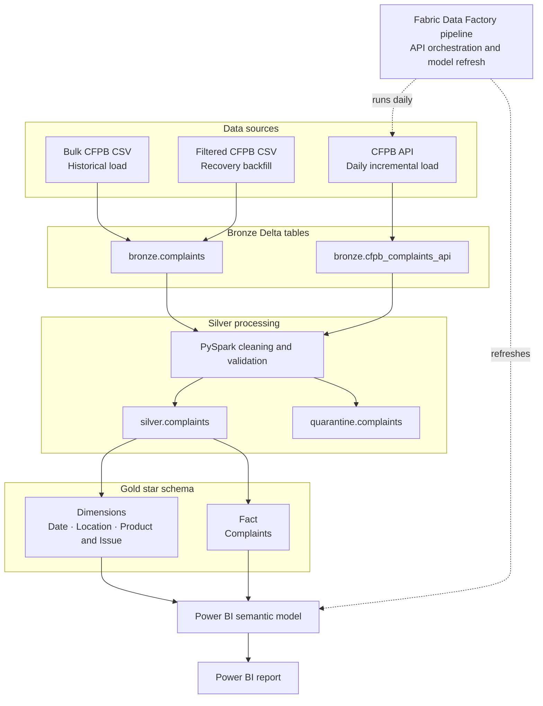
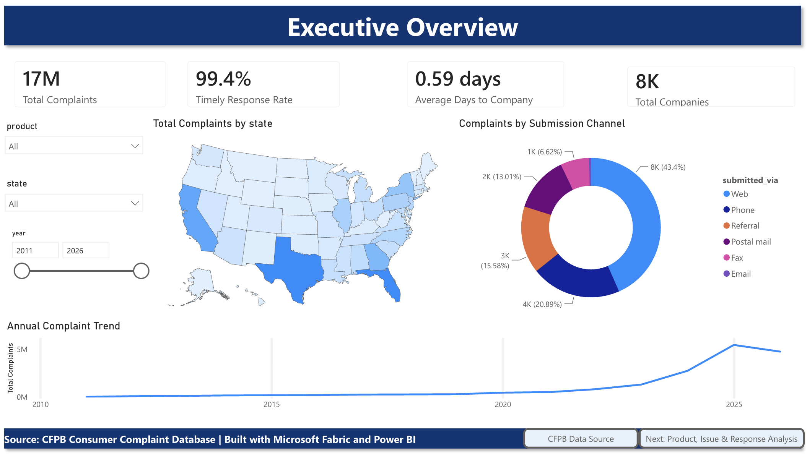
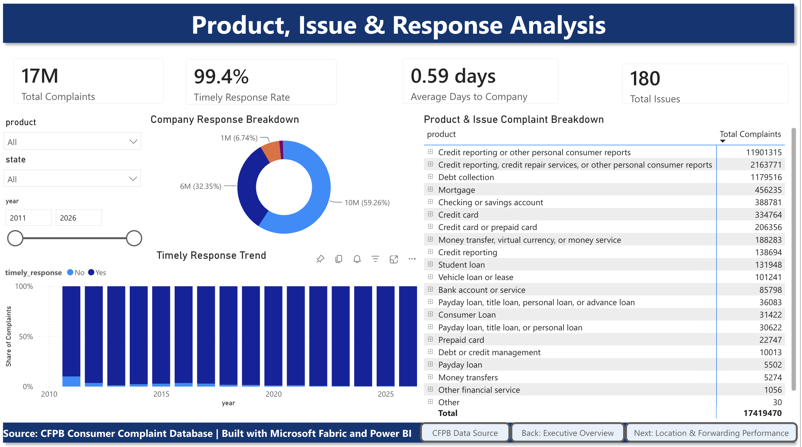
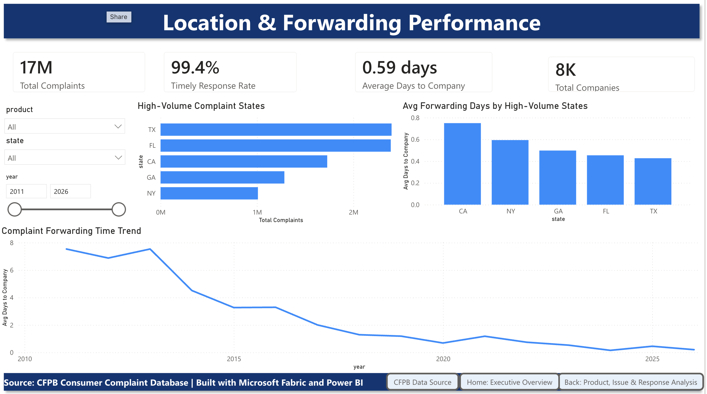
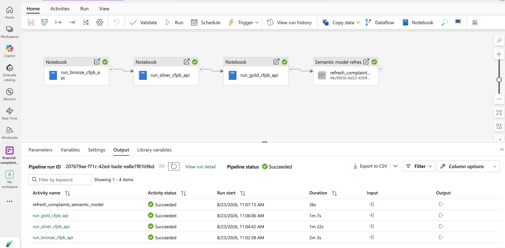
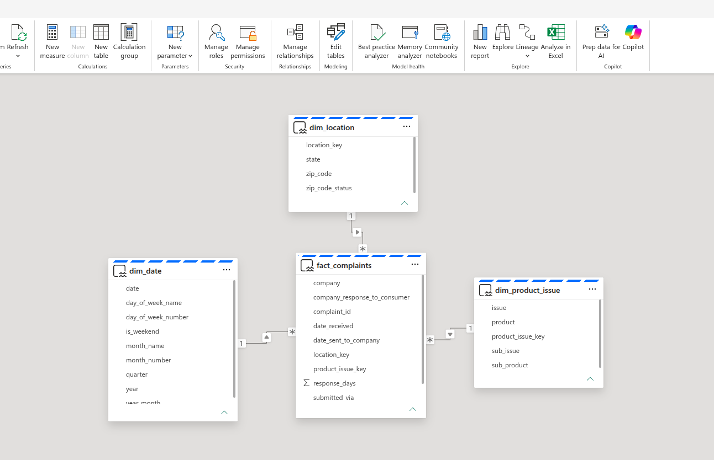

# CFPB Consumer Complaints Analytics

An end-to-end Microsoft Fabric lakehouse and Power BI solution built on **17.4 million consumer complaints from 2011–2026**.

The project combines a bulk historical load, scheduled incremental ingestion from the CFPB API, and a targeted backfill process for repairing date gaps. PySpark and Delta tables support data cleaning, validation, deduplication, and incremental merges before the data is published through a Power BI star schema.

**Technology:** Microsoft Fabric · Fabric Data Factory · PySpark · Spark SQL · Delta Lake · Power BI · DAX

## Architecture


```mermaid
flowchart TB
    subgraph SRC["Data sources"]
        H["Bulk CFPB CSV\nHistorical load"]
        B["Filtered CFPB CSV\nRecovery backfill"]
        A["CFPB API\nDaily incremental load"]
    end

    subgraph BRZ["Bronze Delta tables"]
        BF["bronze.complaints"]
        BA["bronze.cfpb_complaints_api"]
    end

    subgraph SLV["Silver processing"]
        P["PySpark cleaning and validation"]
        S["silver.complaints"]
        Q["quarantine.complaints"]
    end

    subgraph GLD["Gold star schema"]
        D["Dimensions\nDate · Location · Product and Issue"]
        F["Fact\nComplaints"]
    end

    O["Fabric Data Factory pipeline\nAPI orchestration and model refresh"]
    M["Power BI semantic model"]
    R["Power BI report"]

    H --> BF
    B --> BF
    A --> BA

    BF --> P
    BA --> P

    P --> S
    P --> Q

    S --> D
    S --> F

    D --> M
    F --> M
    M --> R

    O -. "runs daily" .-> A
    O -. "refreshes" .-> M
```

## Dashboard

### Executive Overview



### Product, Issue & Response Analysis



### Location & Forwarding Performance



## Implementation

* **Historical backfill:** Loads the CFPB bulk CSV through Bronze, Silver, and Gold to establish the initial dataset.
* **Incremental API load:** Retrieves newly published complaints, merges them into the shared Silver and Gold tables, and refreshes the Power BI semantic model.
* **Recovery backfill:** Processes a filtered CSV for a defined date range without rebuilding the complete dataset.
* **Data quality:** Validates required fields, parses dates, standardizes state and ZIP code values, and routes invalid records to a quarantine table.
* **Duplicate protection:** Reduces incremental source data to one row per `complaint_id` before Delta merges.

## Pipeline Orchestration

The scheduled Fabric Data Factory pipeline runs the API Bronze, Silver, and Gold notebooks in sequence, followed by the semantic model refresh. Downstream activities run only after the preceding activity succeeds.



## Semantic Model

The reporting model contains one complaint-level fact table and three supporting dimensions:

* `gold.fact_complaints`
* `gold.dim_date`
* `gold.dim_location`
* `gold.dim_product_issue`



## Repository Structure

```text
consumer-complaints-analytics/
├── README.md
├── notebooks/
│   ├── historical_backfill/
│   │   ├── bronze.ipynb
│   │   ├── silver.ipynb
│   │   └── gold.ipynb
│   ├── api/
│   │   ├── bronze_cfpb.ipynb
│   │   ├── silver_cfpb.ipynb
│   │   └── gold_cfpb.ipynb
│   └── batch_backfill/
│       ├── bronze_cfpb_batch.ipynb
│       ├── silver_cfpb_batch.ipynb
│       └── gold_cfpb_batch.ipynb
├── screenshots/
│   ├── 01_dashboard_executive_overview.png
│   ├── 02_dashboard_product_issue_response.png
│   ├── 03_dashboard_location_forwarding_performance.png
│   ├── 04_semantic_model_relationships.png
│   └── 05_cfpb_api_pipeline_success.png
└── .gitignore
```

## Running the Project

1. Download the bulk dataset from the [CFPB Consumer Complaint Database](https://www.consumerfinance.gov/data-research/consumer-complaints/).
2. Upload `complaints.csv` to a Microsoft Fabric Lakehouse.
3. Attach the Lakehouse to the notebooks and configure the source path.
4. Run the historical notebooks in Bronze, Silver, and Gold order.
5. Create the Power BI semantic model from the Gold tables.
6. Configure the Fabric pipeline with the three API notebooks and semantic model refresh activity.
7. Use the batch-backfill notebooks only when a defined historical range needs to be recovered.

## Dataset

The extracted CFPB complaints CSV is approximately **8.8 GB** and is not included in this repository. It can be downloaded directly from the [CFPB website](https://www.consumerfinance.gov/data-research/consumer-complaints/).
